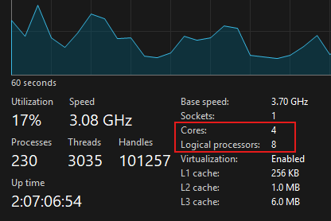

# Threads: Hilos y Concurrencia

---

## ¿Qué son los hilos?

- Objetos que dan la capacidad de hacer más de una tarea al mismo tiempo.
- Los `hilos` (o `threads`) en Java son una herramienta fundamental para ejecutar múltiples tareas de manera concurrente
  dentro de un programa.
- Un `hilo` es la unidad más pequeña de ejecución dentro de un programa. Los programas que usan hilos pueden realizar
  múltiples tareas al mismo tiempo, aprovechando mejor los recursos del sistema, especialmente en procesadores
  multinúcleo.

En Java, los hilos son representados por la clase `Thread` y se pueden crear de dos formas principales:

1. Extendiendo la `clase Thread`.
2. Implementando la `interfaz Runnable`.

## Características

- La Máquina Virtual de Java (JVM) es un sistema `multi-thread` capaz de ejecutar varias tareas (o subprocesos)
  simultáneamente.
- Java soporta Thread con algunas clases e interfaces y con métodos específicos en la clase object.
- La JVM gestiona los detalles, asignación de tiempos de ejecución, prioridades, de forma similar a cómo gestiona un
  Sistema Operativo.
- `Ejecución concurrente`, permite que diferentes partes del programa se ejecuten simultáneamente.
- `Comparación de recursos`, los hilos de un mismo proceso comparten memoria y recursos del sistema.
- `Ligereza`, comparados con los procesos, los hilos son más ligeros y rápidos.
- `Control`, java ofrece métodos para controlar los hilos, como `start()`, `sleep()`, `join()`, etc.

## Ciclo de vida de un Thread

Un hilo en java pasa por varios estados durante su vida.

### 1. NEW

Un hilo `NEW` es uno que se ha creado pero que aún no se ha iniciado con el método `start()`.

````java
public class Main {
    public static void main(String[] args) {
        Runnable runnable = new Tarea();
        Thread t = new Thread(runnable);
        System.out.println(t.getState()); //NEW
    }
}
````

### 2. RUNNABLE

Un hilo `RUNNABLE` es uno que se ha creado e iniciado con el `start()`. El sistema operativo decide cuándo asignarle
tiempo de CPU.

````java
public class Main {
    public static void main(String[] args) {
        Runnable runnable = new Tarea();
        Thread t = new Thread(runnable);
        t.start();
        System.out.println(t.getState()); //RUNNABLE
    }
}
````

### 3. BLOCKED

- Un hilo está en estado `BLOCKED` cuando actualmente no es elegible para ejecutarse.
- Entra en este estado cuando está esperando un bloqueo del monitor e intenta acceder a una sección de código que está
  bloqueada por algún otro hilo en un método sincronizado.

````java
public class Main {
    public static void main(String[] args) throws InterruptedException {
        Runnable runnable = () -> recurso();

        Thread t1 = new Thread(runnable);
        Thread t2 = new Thread(runnable);
        t1.start();
        t2.start();
        Thread.sleep(1000);
        System.out.println(t2.getState()); //BLOCKED
    }

    public static synchronized void recurso() {
        //realizando algún proceso compartido entre hilos
        while (true) {
        }
    }
}
````

### 4. WAITING

- Un hilo está en estado `WAITING` cuando está esperando que otro hilo realice una acción en particular.
- Un hilo puede entrar en este estado llamando a cualquiera de los dos métodos `wait()` y `join()`.
- `join()`, se utiliza para hacer que un hilo espere a que otro hilo termine su ejecución antes de continuar. Es como
  decir, *"No sigas adelante hasta que el hilo en el que llamé `join()` haya terminado"*.

````java
public class Main {
    public static void main(String[] args) throws InterruptedException {
        Thread t1 = Thread.currentThread();
        Thread t2 = new Thread(() -> {
            //realizando alguna tarea costosa
            try {
                Thread.sleep(5000);
            } catch (InterruptedException e) {
                System.out.println(t1.getState()); //WAITING
            }
        });
        t2.start();
        t2.join();
    }
}
````

### 5. TERMINATED

- Este es el estado de un hilo muerto. Está en el estado `TERMINATED` cuando ha finalizado la ejecución o se terminó de
  forma anormal.
- También podemos usar el método `isAlive()` para determinar si el hilo está vivo o no.

````java
public class Main {
    public static void main(String[] args) throws InterruptedException {
        Thread t1 = new Thread(() -> {
            //realizando alguna tarea rápida
        });

        t1.start();
        Thread.sleep(1000);

        System.out.println(t1.getState()); //TERMINATED
        System.out.println(t1.isAlive()); //false
    }
}
````

## Métodos wait(), notify() y notifyAll()

- La clase Object tiene tres métodos que permiten que los hilos se sincronicen y comuniquen sobre el estado bloqueado de
  un recurso.
- `wait()`, libera el bloqueo para que otros hilos tengan la oportunidad de acceder a un recurso compartido (métodos
  sincronizado) y queda esperando indefinidamente hasta que otro hilo invoca `notify()` o `notifyAll()`.
- `notify()` y `notifyAll()` se usa para despertar los hilos que están esperando un acceso a un recurso compartido
  (monitor).

## Método sleep()

- `Thread.sleep()`, envía el hilo actual al estado `TIMED_WAITING` durante algún tiempo.
- Permanece dormido hasta que el tiempo expire o se llame al método `interrupt()`.

````java
public class Main {
    public static void main(String[] args) throws InterruptedException {
        Thread t1 = new Thread(() -> {
            try {
                Thread.sleep(5000);
            } catch (InterruptedException e) {
                throw new RuntimeException(e);
            }
        });

        t1.start();
        Thread.sleep(1000);
        System.out.println(t1.getState()); //TIMED_WAITING
    }
}
````

## Creando hilos heredando de la clase Thread

Creamos la clase `MyThread` que hereda de la clase `Thread`. Le definimos un constructor para poder asignarle un nombre
personalizado al hilo.

En el método `run()`, mostramos información del inicio y fin del hilo y en la parte intermedia, alguna lógica que
quisiéramos hacer. En este caso, imprimirá 10 veces el nombre del hilo.

````java

@Slf4j
public class MyThread extends Thread {

    public MyThread(String name) {
        super(name);
    }

    @Override
    public void run() {
        log.info("Inicia el hilo \"{}\"", this.getName());

        IntStream.range(0, 10)
                .forEach(index -> log.info("{}, {}", index, this.getName()));

        log.info("Finaliza el hilo \"{}\"", this.getName());
    }
}
````

Creamos la clase principal únicamente instanciando nuestra clase `MyThread`.

````java

@Slf4j
public class Main {
    public static void main(String[] args) {
        Thread thread = new MyThread("uns");
        log.info(String.valueOf(thread.getState()));
    }
}
````

Si ejecutamos la clase anterior veremos el estado que se imprime será `NEW` dado que no hemos iniciado la ejecución del
hilo, solo lo hemos creado.

````bash
23:30:14.230 [main] INFO dev.magadiflo.app.thread.Main -- NEW
````

Ahora agregamos el `thread.start()` para iniciar la ejecución del hilo.

````java

@Slf4j
public class Main {
    public static void main(String[] args) {
        Thread thread = new MyThread("uns");
        thread.start();
        log.info(String.valueOf(thread.getState()));
    }
}
````

Observemos que ahora el `thread.getState()` es `RUNNABLE` y eso es correcto, ya que el hilo fue creado y ha sido
iniciado con el `start()`.

````bash
23:42:19.383 [main] INFO dev.magadiflo.app.thread.Main -- RUNNABLE
23:42:19.383 [uns] INFO dev.magadiflo.app.thread.MyThread -- Inicia el hilo "uns"
23:42:19.387 [uns] INFO dev.magadiflo.app.thread.MyThread -- 0, uns
23:42:19.387 [uns] INFO dev.magadiflo.app.thread.MyThread -- 1, uns
23:42:19.387 [uns] INFO dev.magadiflo.app.thread.MyThread -- 2, uns
23:42:19.387 [uns] INFO dev.magadiflo.app.thread.MyThread -- 3, uns
23:42:19.387 [uns] INFO dev.magadiflo.app.thread.MyThread -- 4, uns
23:42:19.387 [uns] INFO dev.magadiflo.app.thread.MyThread -- 5, uns
23:42:19.387 [uns] INFO dev.magadiflo.app.thread.MyThread -- 6, uns
23:42:19.387 [uns] INFO dev.magadiflo.app.thread.MyThread -- 7, uns
23:42:19.387 [uns] INFO dev.magadiflo.app.thread.MyThread -- 8, uns
23:42:19.387 [uns] INFO dev.magadiflo.app.thread.MyThread -- 9, uns
23:42:19.387 [uns] INFO dev.magadiflo.app.thread.MyThread -- Finaliza el hilo "uns"
````

Notar que se imprime `RUNNABLE` en el hilo principal `[main]`, mientras que los demás se realizan en el hilo llamado
`[uns]`. Es decir, mientras se va imprimiendo `RUNNABLE` en el hilo principal, de manera asíncrona se va creando y
ejecutando el otro hilo llamado `uns`.

**Nota**
> El estado `RUNNABLE` no necesariamente significa que el hilo esté ejecutándose en ese momento, sino que está en cola
> y listo para ejecutarse cuando el sistema operativo lo permita. Este detalle es importante porque muchas veces se
> interpreta erróneamente que `RUNNABLE` implica ejecución activa, pero en realidad significa que el hilo está
> disponible para que el sistema operativo le asigne tiempo de CPU.

Ahora crearemos un hilo adicional y procedemos a ejecutar la clase Main.

````java

@Slf4j
public class Main {
    public static void main(String[] args) {
        Thread t1 = new MyThread("uns");
        t1.start();

        Thread t2 = new MyThread("ucv");
        t2.start();

        log.info(String.valueOf(t1.getState()));
        log.info(String.valueOf(t2.getState()));
    }
}
````

A continuación es muestra el resultado obtenido.

````bash
00:00:59.969 [ucv] INFO dev.magadiflo.app.thread.MyThread -- Inicia el hilo "ucv"
00:00:59.969 [uns] INFO dev.magadiflo.app.thread.MyThread -- Inicia el hilo "uns"
00:00:59.969 [main] INFO dev.magadiflo.app.thread.Main -- RUNNABLE
00:00:59.972 [main] INFO dev.magadiflo.app.thread.Main -- RUNNABLE
00:00:59.973 [uns] INFO dev.magadiflo.app.thread.MyThread -- 0, uns
00:00:59.973 [ucv] INFO dev.magadiflo.app.thread.MyThread -- 0, ucv
00:00:59.973 [uns] INFO dev.magadiflo.app.thread.MyThread -- 1, uns
00:00:59.973 [ucv] INFO dev.magadiflo.app.thread.MyThread -- 1, ucv
00:00:59.975 [uns] INFO dev.magadiflo.app.thread.MyThread -- 2, uns
00:00:59.975 [ucv] INFO dev.magadiflo.app.thread.MyThread -- 2, ucv
00:00:59.975 [uns] INFO dev.magadiflo.app.thread.MyThread -- 3, uns
00:00:59.975 [ucv] INFO dev.magadiflo.app.thread.MyThread -- 3, ucv
00:00:59.975 [uns] INFO dev.magadiflo.app.thread.MyThread -- 4, uns
00:00:59.975 [ucv] INFO dev.magadiflo.app.thread.MyThread -- 4, ucv
00:00:59.975 [uns] INFO dev.magadiflo.app.thread.MyThread -- 5, uns
00:00:59.975 [ucv] INFO dev.magadiflo.app.thread.MyThread -- 5, ucv
00:00:59.975 [uns] INFO dev.magadiflo.app.thread.MyThread -- 6, uns
00:00:59.975 [ucv] INFO dev.magadiflo.app.thread.MyThread -- 6, ucv
00:00:59.975 [uns] INFO dev.magadiflo.app.thread.MyThread -- 7, uns
00:00:59.975 [uns] INFO dev.magadiflo.app.thread.MyThread -- 8, uns
00:00:59.975 [ucv] INFO dev.magadiflo.app.thread.MyThread -- 7, ucv
00:00:59.975 [uns] INFO dev.magadiflo.app.thread.MyThread -- 9, uns
00:00:59.975 [ucv] INFO dev.magadiflo.app.thread.MyThread -- 8, ucv
00:00:59.975 [uns] INFO dev.magadiflo.app.thread.MyThread -- Finaliza el hilo "uns"
00:00:59.975 [ucv] INFO dev.magadiflo.app.thread.MyThread -- 9, ucv
00:00:59.975 [ucv] INFO dev.magadiflo.app.thread.MyThread -- Finaliza el hilo "ucv"
````

Observamos que los hilos se ejecutan en paralelo, pareciera que no, pero sí se están ejecutando en paralelo. Recordemos
que los procesadores de hoy en día son de más un core, 4 core, 8 core, etc. por lo que cada hilo corre en su propio
procesador de forma paralela. No es que estemos trabajando con un solo core y se va ejecutando de forma intermitente
1 hilo, luego el otro, y así sucesivamente, sino, por el contrario, sí trabajamos con más de un core y eso nos permite
que se ejecuten en paralelo.

En el caso del pc de escritorio que uso, esta serían mis características.



Eso significa que mi PC tiene `4 núcleos físicos (cores)` y `8 procesadores lógicos`, lo que indica que tu `CPU`
soporta `Hyper-Threading` (o tecnología similar), que permite que cada núcleo físico maneje dos hilos simultáneamente.

Esto mejora el rendimiento en tareas multihilo, ya que el sistema operativo ve 8 procesadores lógicos aunque
haya solo 4 núcleos físicos.

`Hyper-Threading (HT) o SMT`: Permite que un solo núcleo físico ejecute dos hilos de forma simultánea (aunque no al
mismo tiempo, sino de manera intercalada), aprovechando mejor las capacidades del núcleo y aumentando el rendimiento en
tareas paralelizadas.

Aunque tu CPU tiene 4 núcleos físicos, los 8 procesadores lógicos (o hilos) indican que cada uno de esos 4 núcleos
físicos puede ejecutar dos hilos a la vez (teóricamente). No es que los hilos sean ejecutados al mismo tiempo en un
núcleo, sino que el procesador alterna rápidamente entre ellos para que parezca que se están ejecutando simultáneamente,
maximizando el uso del núcleo.

Ahora, como vimos, en mi caso tengo 4 núcleos físicos y si por ejemplo ejecutamos 3 procesos que se asignan a esos
núcleos, veremos que sí se ejecutarían en paralelo (no de forma intercalada), porque cada uno de esos procesos ocuparía
un núcleo físico distinto.

- Cada uno de los 3 procesos se asignaría a un núcleo físico diferente. Como tienes 4 núcleos, uno de los núcleos
  quedaría libre (o podría ser utilizado por otro proceso si hay más tareas que ejecutar).


- Los 3 procesos se ejecutarían simultáneamente (realmente en paralelo), aprovechando los núcleos físicos disponibles.
  Esto es verdadero paralelismo, ya que cada proceso tiene su propio núcleo para ejecutarse.

Si los procesos son independientes y tu sistema operativo puede asignar eficientemente cada uno a un núcleo, los
procesos se ejecutarán en paralelo (de forma simultánea) en los núcleos disponibles, sin necesidad de alternar entre
hilos como sucede con el Hyper-Threading o SMT.

Finalmente, con las características de tu PC, que tiene 4 núcleos físicos y 8 procesadores lógicos (gracias a
Hyper-Threading o SMT), en efecto, podrías aprovechar tanto paralelismo verdadero como ejecución intercalada.

## Creando hilos implementando la interface Runnable

Creamos una clase que implemente la interfaz `Runnable`. Luego definimos la lógica dentro del método `run()` donde
vamos a ir imprimiendo valores y luego pausando el hilo durante un tiempo aleatorio.

````java

@Slf4j
@Getter
@RequiredArgsConstructor
public class TaskRunnable implements Runnable {

    private final String name;

    @Override
    public void run() {
        log.info("Inicia el hilo \"{}\"", this.name);

        IntStream.range(0, 10)
                .forEach(index -> {
                    log.info("{}, {}", index, this.name);
                    try {
                        Thread.sleep((long) (Math.random() * 1000));
                    } catch (InterruptedException e) {
                        e.printStackTrace();
                    }
                });

        log.info("Finaliza el hilo \"{}\"", this.name);
    }
}
````

Creamos la clase principal donde ejecutaremos la clase anterior. Hemos creado 3 hilos y a cada hilo le he asignado un
nombre, además ese mismo nombre se lo paso a la clase `TaskRunnable` para poder mostrarlo en el mensaje.

````java
public class TaskMain {
    public static void main(String[] args) {
        Thread t1 = new Thread(new TaskRunnable("Spring"), "Spring");
        t1.start();

        Thread t2 = new Thread(new TaskRunnable("Docker"), "Docker");
        t2.start();

        Thread t3 = new Thread(new TaskRunnable("Angulr"), "Angulr");
        t3.start();
    }
}
````

Luego de ejecutar la clase anterior vemos que se van ejecutando en paralelo los tres hilos y se establece como una
especie de competencia por ver cuál es el que finaliza primero, esto debido a la pausa aleatoria que pusimos en la
iteración.

````bash
12:54:03.006 [Angulr] INFO dev.magadiflo.app.runnable.TaskRunnable -- Inicia el hilo "Angulr"
12:54:03.006 [Spring] INFO dev.magadiflo.app.runnable.TaskRunnable -- Inicia el hilo "Spring"
12:54:03.006 [Docker] INFO dev.magadiflo.app.runnable.TaskRunnable -- Inicia el hilo "Docker"
12:54:03.014 [Angulr] INFO dev.magadiflo.app.runnable.TaskRunnable -- 0, Angulr
12:54:03.014 [Spring] INFO dev.magadiflo.app.runnable.TaskRunnable -- 0, Spring
12:54:03.014 [Docker] INFO dev.magadiflo.app.runnable.TaskRunnable -- 0, Docker
12:54:03.207 [Docker] INFO dev.magadiflo.app.runnable.TaskRunnable -- 1, Docker
12:54:03.234 [Docker] INFO dev.magadiflo.app.runnable.TaskRunnable -- 2, Docker
12:54:03.278 [Spring] INFO dev.magadiflo.app.runnable.TaskRunnable -- 1, Spring
12:54:03.583 [Spring] INFO dev.magadiflo.app.runnable.TaskRunnable -- 2, Spring
12:54:03.945 [Angulr] INFO dev.magadiflo.app.runnable.TaskRunnable -- 1, Angulr
12:54:04.007 [Docker] INFO dev.magadiflo.app.runnable.TaskRunnable -- 3, Docker
12:54:04.008 [Spring] INFO dev.magadiflo.app.runnable.TaskRunnable -- 3, Spring
12:54:04.110 [Spring] INFO dev.magadiflo.app.runnable.TaskRunnable -- 4, Spring
12:54:04.450 [Angulr] INFO dev.magadiflo.app.runnable.TaskRunnable -- 2, Angulr
12:54:04.572 [Spring] INFO dev.magadiflo.app.runnable.TaskRunnable -- 5, Spring
12:54:04.654 [Docker] INFO dev.magadiflo.app.runnable.TaskRunnable -- 4, Docker
12:54:04.770 [Angulr] INFO dev.magadiflo.app.runnable.TaskRunnable -- 3, Angulr
12:54:05.266 [Angulr] INFO dev.magadiflo.app.runnable.TaskRunnable -- 4, Angulr
12:54:05.324 [Spring] INFO dev.magadiflo.app.runnable.TaskRunnable -- 6, Spring
12:54:05.332 [Docker] INFO dev.magadiflo.app.runnable.TaskRunnable -- 5, Docker
12:54:05.482 [Docker] INFO dev.magadiflo.app.runnable.TaskRunnable -- 6, Docker
12:54:05.657 [Docker] INFO dev.magadiflo.app.runnable.TaskRunnable -- 7, Docker
12:54:05.745 [Angulr] INFO dev.magadiflo.app.runnable.TaskRunnable -- 5, Angulr
12:54:06.075 [Angulr] INFO dev.magadiflo.app.runnable.TaskRunnable -- 6, Angulr
12:54:06.076 [Spring] INFO dev.magadiflo.app.runnable.TaskRunnable -- 7, Spring
12:54:06.326 [Docker] INFO dev.magadiflo.app.runnable.TaskRunnable -- 8, Docker
12:54:06.442 [Spring] INFO dev.magadiflo.app.runnable.TaskRunnable -- 8, Spring
12:54:06.451 [Spring] INFO dev.magadiflo.app.runnable.TaskRunnable -- 9, Spring
12:54:06.864 [Angulr] INFO dev.magadiflo.app.runnable.TaskRunnable -- 7, Angulr
12:54:07.137 [Docker] INFO dev.magadiflo.app.runnable.TaskRunnable -- 9, Docker
12:54:07.214 [Spring] INFO dev.magadiflo.app.runnable.TaskRunnable -- Finaliza el hilo "Spring"
12:54:07.761 [Docker] INFO dev.magadiflo.app.runnable.TaskRunnable -- Finaliza el hilo "Docker"
12:54:07.833 [Angulr] INFO dev.magadiflo.app.runnable.TaskRunnable -- 8, Angulr
12:54:08.768 [Angulr] INFO dev.magadiflo.app.runnable.TaskRunnable -- 9, Angulr
12:54:09.204 [Angulr] INFO dev.magadiflo.app.runnable.TaskRunnable -- Finaliza el hilo "Angulr"
````

## Implementa hilos con expresiones lambda y Runnable

En la clase anterior implementamos la interfaz `Runnable`, pero en esta nueva sección, haremos la implementación
utilizando expresiones lambda o función anónima.``

````java

@Slf4j
public class TaskRunnableLambda {
    public static void main(String[] args) {
        Thread t1 = new Thread(runnable(), "Spring");
        t1.start();

        Thread t2 = new Thread(runnable(), "Docker");
        t2.start();

        Thread t3 = new Thread(runnable(), "Angulr");
        t3.start();
    }

    private static Runnable runnable() {
        return () -> {
            log.info("Inicia el hilo \"{}\"", Thread.currentThread().getName());

            IntStream.range(0, 10)
                    .forEach(index -> {
                        log.info("{}, {}", index, Thread.currentThread().getName());
                        try {
                            Thread.sleep((long) (Math.random() * 1000));
                        } catch (InterruptedException e) {
                            e.printStackTrace();
                        }
                    });

            log.info("Finaliza el hilo \"{}\"", Thread.currentThread().getName());
        };
    }
}
````

Si ejecutamos la clase anterior veremos que todo sigue funcionando igual, pero esta vez hemos realizado la
implementación del Runnable usando una expresión lambda.

````bash
09:55:00.500 [Docker] INFO dev.magadiflo.app.runnable.TaskRunnableLambda -- Inicia el hilo "Docker"
09:55:00.500 [Spring] INFO dev.magadiflo.app.runnable.TaskRunnableLambda -- Inicia el hilo "Spring"
09:55:00.500 [Angulr] INFO dev.magadiflo.app.runnable.TaskRunnableLambda -- Inicia el hilo "Angulr"
09:55:00.510 [Spring] INFO dev.magadiflo.app.runnable.TaskRunnableLambda -- 0, Spring
09:55:00.511 [Docker] INFO dev.magadiflo.app.runnable.TaskRunnableLambda -- 0, Docker
09:55:00.545 [Angulr] INFO dev.magadiflo.app.runnable.TaskRunnableLambda -- 0, Angulr
09:55:00.588 [Docker] INFO dev.magadiflo.app.runnable.TaskRunnableLambda -- 1, Docker
09:55:01.149 [Spring] INFO dev.magadiflo.app.runnable.TaskRunnableLambda -- 1, Spring
09:55:01.161 [Angulr] INFO dev.magadiflo.app.runnable.TaskRunnableLambda -- 1, Angulr
09:55:01.175 [Docker] INFO dev.magadiflo.app.runnable.TaskRunnableLambda -- 2, Docker
09:55:01.754 [Spring] INFO dev.magadiflo.app.runnable.TaskRunnableLambda -- 2, Spring
09:55:02.050 [Angulr] INFO dev.magadiflo.app.runnable.TaskRunnableLambda -- 2, Angulr
09:55:02.142 [Docker] INFO dev.magadiflo.app.runnable.TaskRunnableLambda -- 3, Docker
09:55:02.155 [Spring] INFO dev.magadiflo.app.runnable.TaskRunnableLambda -- 3, Spring
09:55:02.418 [Docker] INFO dev.magadiflo.app.runnable.TaskRunnableLambda -- 4, Docker
09:55:02.429 [Spring] INFO dev.magadiflo.app.runnable.TaskRunnableLambda -- 4, Spring
09:55:02.801 [Angulr] INFO dev.magadiflo.app.runnable.TaskRunnableLambda -- 3, Angulr
09:55:02.910 [Angulr] INFO dev.magadiflo.app.runnable.TaskRunnableLambda -- 4, Angulr
09:55:03.203 [Docker] INFO dev.magadiflo.app.runnable.TaskRunnableLambda -- 5, Docker
09:55:03.398 [Spring] INFO dev.magadiflo.app.runnable.TaskRunnableLambda -- 5, Spring
09:55:03.564 [Angulr] INFO dev.magadiflo.app.runnable.TaskRunnableLambda -- 5, Angulr
09:55:03.981 [Docker] INFO dev.magadiflo.app.runnable.TaskRunnableLambda -- 6, Docker
09:55:04.006 [Angulr] INFO dev.magadiflo.app.runnable.TaskRunnableLambda -- 6, Angulr
09:55:04.017 [Docker] INFO dev.magadiflo.app.runnable.TaskRunnableLambda -- 7, Docker
09:55:04.107 [Docker] INFO dev.magadiflo.app.runnable.TaskRunnableLambda -- 8, Docker
09:55:04.151 [Angulr] INFO dev.magadiflo.app.runnable.TaskRunnableLambda -- 7, Angulr
09:55:04.272 [Spring] INFO dev.magadiflo.app.runnable.TaskRunnableLambda -- 6, Spring
09:55:04.514 [Docker] INFO dev.magadiflo.app.runnable.TaskRunnableLambda -- 9, Docker
09:55:04.644 [Angulr] INFO dev.magadiflo.app.runnable.TaskRunnableLambda -- 8, Angulr
09:55:05.155 [Spring] INFO dev.magadiflo.app.runnable.TaskRunnableLambda -- 7, Spring
09:55:05.155 [Angulr] INFO dev.magadiflo.app.runnable.TaskRunnableLambda -- 9, Angulr
09:55:05.204 [Docker] INFO dev.magadiflo.app.runnable.TaskRunnableLambda -- Finaliza el hilo "Docker"
09:55:05.372 [Spring] INFO dev.magadiflo.app.runnable.TaskRunnableLambda -- 8, Spring
09:55:05.669 [Angulr] INFO dev.magadiflo.app.runnable.TaskRunnableLambda -- Finaliza el hilo "Angulr"
09:55:05.793 [Spring] INFO dev.magadiflo.app.runnable.TaskRunnableLambda -- 9, Spring
09:55:06.738 [Spring] INFO dev.magadiflo.app.runnable.TaskRunnableLambda -- Finaliza el hilo "Spring"
````
